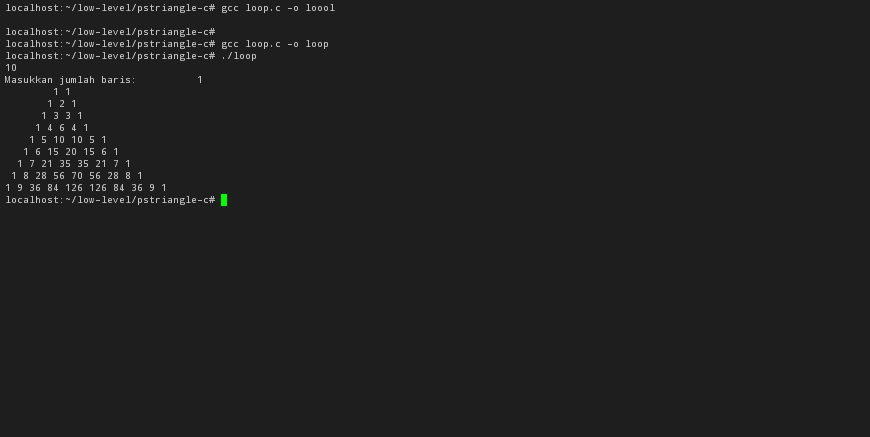

# pstriangle-c 

# Simple Pascal Triangle With C 

## Build

```bash
gcc -o loop.c -o loop
```

## Run Array Version

```bash
gcc arr.c -o arr

## Run

```bash
./main
```
## Screenshot


## References

- [Pascal Triangle](https://en.wikipedia.org/wiki/Pascal%27s_triangle)
- [Pascal Triangle](https://en.wikipedia.org/wiki/Pascal%27s_triangle)

## License

MIT

## Thank You
